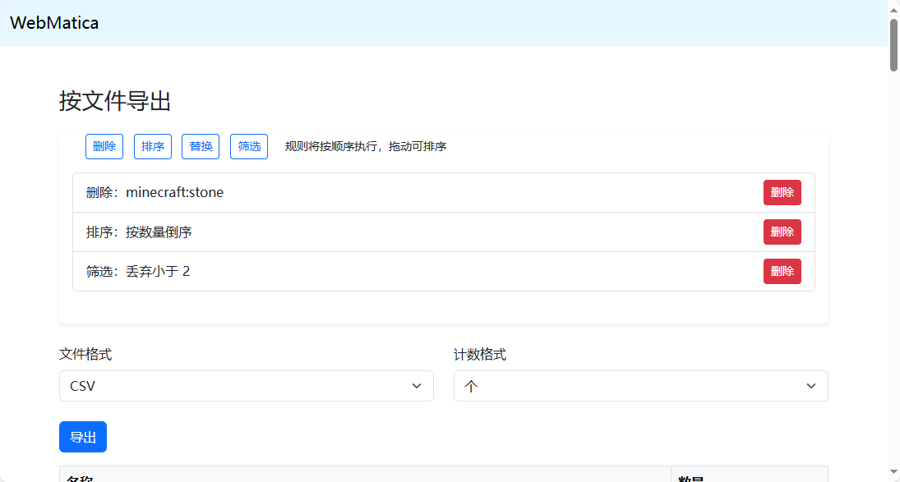

# WebMatica

简体中文 | [English](README_en.md)

`WebMatica` 是一个基于 Web 的 Litematica 文件查看与处理工具，支持用户上传 `.litematic` 文件，并进行结构解析、区域数据统计、导出等操作。适用于 Minecraft 建筑爱好者和模组开发者。

---

## 📌 功能特性

- **文件上传**：支持上传 `.litematic` 格式的 Minecraft 建筑文件。
- **三维预览**：使用 `Three.js` 渲染建筑结构，提供基础的 3D 查看功能。
- **数据统计**：
  - 按选区（Region）统计材料清单。
  - 按整个文件统计材料总览。
- **数据导出**：
  - 支持 CSV / TXT 格式导出。
  - 支持多种规则（排序、筛选、替换、删除）对数据进行预处理。
- **自动清理过期文件**：
  - 可配置自动删除超过指定时间的上传文件和导出文件。
  - 在 `cfg.json` 中设置 `autodelete` 字段（单位：秒），如 `3600` 表示一小时。

---

## 🧩 技术架构

### 后端（Node.js + Express）
- **路由管理**：
  - `/proceed`：接收 `.litematic` 文件并启动处理流程。
  - `/status`：查询处理状态。
  - `/region` & `/regionsum`：获取特定选区或整体的材料数据。
  - `/exportapi`：根据规则导出统计数据。
- **核心模块**：
  - 使用 `deepslate` 解析 `.litematic` 文件。
  - 使用 `prismarine-viewer` 渲染 3D 场景。
  - 数据处理逻辑包含异步读写、转换、过滤、排序等。
- **持久化**：
  - 原始文件存储于 `/uploads/file/`
  - 中间结果存储于 `/uploads/info/` 与 `/uploads/gltf/`
  - 导出文件存放于 `/uploads/export/`
- **自动清理机制**：
  - 应用每 10 秒扫描一次 `uploads` 目录。
  - 如有设置，删除修改时间超出 `AutoDelete` 配置值的文件。

### 前端（EJS + Bootstrap + JavaScript）
- **页面结构**：
  - `index.ejs`：上传页面。
<div style="text-align: center;">
    
</div>
  

  - `procpage.ejs`：处理中状态页。

<div style="text-align: center;">
  
</div>

  - `detail.ejs`：详情查看页（含 3D 预览）。
  
<div style="text-align: center;">
  
</div>

<div style="text-align: center;">
  
</div>

  - `exportpage.ejs`：导出配置与预览页。
  
<div style="text-align: center;">
  
</div>

- **交互逻辑**：
  - 异步加载数据并渲染选区。
  - 拖拽排序规则。
  - 模态框添加不同类型的处理规则。
  - 下载导出结果。

---

## 📦 目录结构

```
.
├── controllers/
│   └── index.js
├── models/
│   └── index.js
├── routes/
│   ├── exportapi.js
│   ├── index.js
│   ├── region.js
│   └── status.js
├── views/
│   ├── detail.ejs
│   ├── exportpage.ejs
│   ├── index.ejs
│   ├── license.ejs
│   └── procpage.ejs
└── app.js
```

---

## ⚙️ 配置说明

### `config/cfg.json`

```json
{
  "port": 3000,
  "autodelete": 3600
}
```

- `port`: 设置服务器监听的端口号。
- `autodelete`: 自动删除上传目录下旧文件的时间阈值（单位：秒）。设为 `-1` 表示禁用自动删除。

### `config/lang.json`

对应版本的语言文件

---

## 🚀 快速开始

Clone 项目后，在项目根目录下执行以下命令安装依赖并启动服务器：

```bash
npm install
npm start
```

访问 `http://localhost:3000` 即可使用。

---

## 📝 许可证

项目允许你自由地使用、复制、修改本软件，但必须保留原作者署名，不得销售本软件。