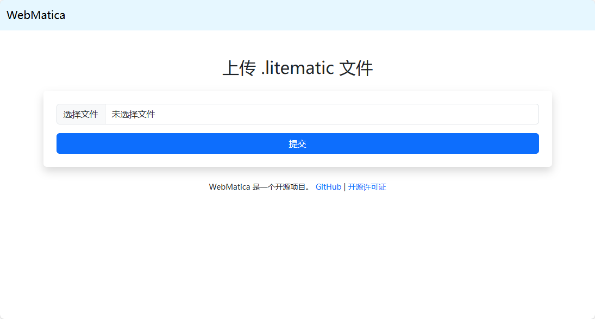
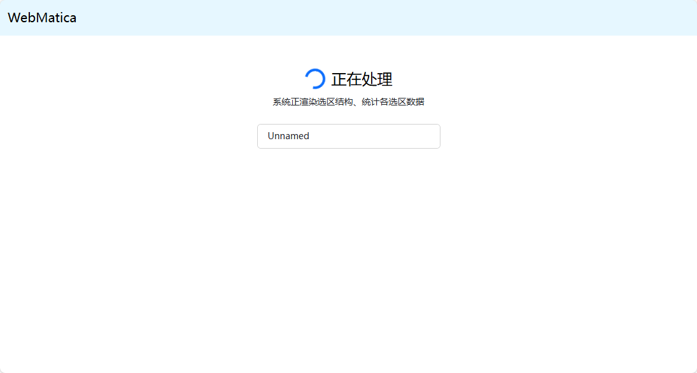
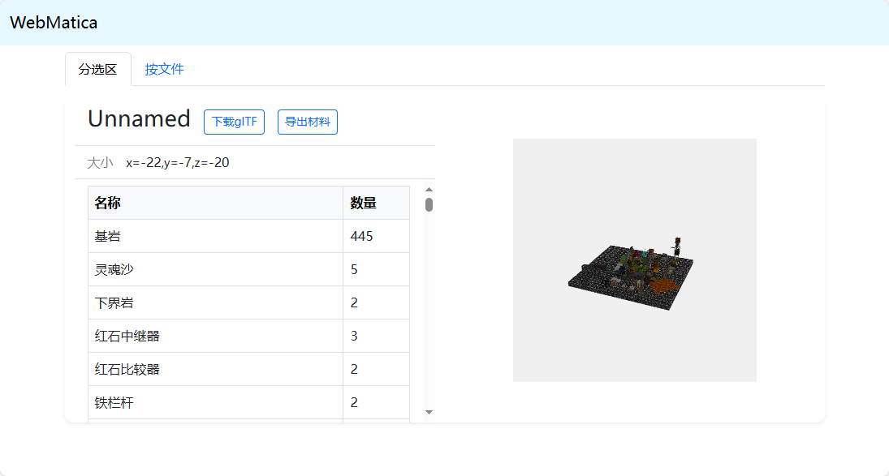
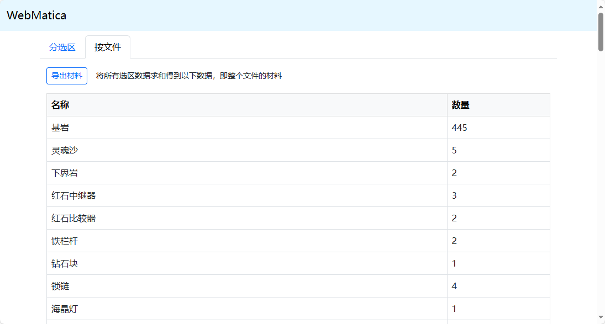
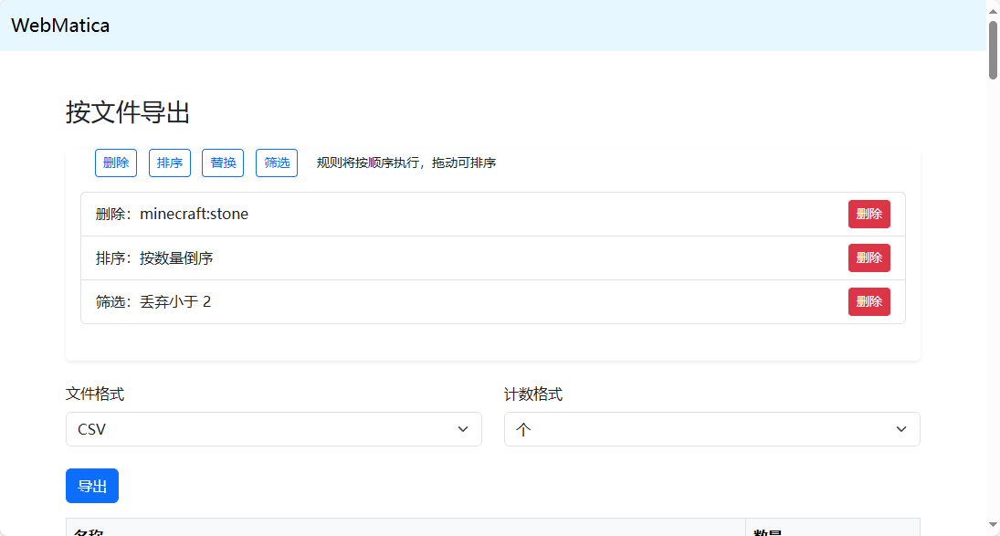

# WebMatica

[简体中文](README.md) | English

`WebMatica` is a web-based Litematica file viewer and processing tool that supports uploading `.litematic` files, structural parsing, region data statistics, and export operations. Designed for Minecraft builders and mod developers.

---

## 📌 Features

- **File Upload**: Supports Minecraft building files in `.litematic` format.
- **3D Preview**: Renders building structures using `Three.js` with basic 3D viewing capabilities.
- **Data Statistics**:
  - Material list by selected region(s).
  - Overall material overview for entire files.
- **Data Export**:
  - Export to CSV/TXT formats.
  - Preprocessing with sorting, filtering, replacement, and deletion rules.
- **Automatic Cleanup**:
  - Configurable deletion of expired files older than specified time.
  - Set `autodelete` field in `cfg.json` (unit: seconds). Example: `3600` for 1 hour.

---

## 🧩 Technical Architecture

### Backend (Node.js + Express)
- **Routing**:
  - `/proceed`: Receive `.litematic` files and start processing.
  - `/status`: Query processing status.
  - `/region` & `/regionsum`: Get material data for specific regions or total.
  - `/exportapi`: Export statistics with custom rules.
- **Core Modules**:
  - Parse `.litematic` using `deepslate`.
  - Render 3D scenes with `prismarine-viewer`.
  - Data processing with async read/write, transformation, filtering, and sorting.
- **Persistence**:
  - Original files in `/uploads/file/`
  - Intermediate results in `/uploads/info/` and `/uploads/gltf/`
  - Exports stored in `/uploads/export/`
- **Cleanup Mechanism**:
  - Scans `uploads` directory every 10 seconds.
  - Deletes files older than `AutoDelete` threshold if configured.

### Frontend (EJS + Bootstrap + JavaScript)
- **Pages**:
  - `index.ejs`: Upload interface.
  <div style="text-align: center;">
    
  </div>

  - `procpage.ejs`: Processing status page.
  <div style="text-align: center;">
    
  </div>

  - `detail.ejs`: Detail view (with 3D preview).
  <div style="text-align: center;">
    
  </div>
  <div style="text-align: center;">
    
  </div>

  - `exportpage.ejs`: Export configuration and preview.
  <div style="text-align: center;">
    
  </div>

- **Interactivity**:
  - Async loading and rendering of regions.
  - Drag-and-drop rule sorting.
  - Modal dialogs for adding processing rules.
  - Download export results.

---

## 📦 Directory Structure

```
.
├── controllers/
│   └── index.js
├── models/
│   └── index.js
├── routes/
│   ├── exportapi.js
│   ├── index.js
│   ├── region.js
│   └── status.js
├── views/
│   ├── detail.ejs
│   ├── exportpage.ejs
│   ├── index.ejs
│   ├── license.ejs
│   └── procpage.ejs
└── app.js
```

---

## ⚙️ Configuration

### `config/cfg.json`

```json
{
  "port": 3000,
  "autodelete": 3600,
  "version": "1.21.4"
}
```

- `port`: Server listening port number.
- `autodelete`: Auto-delete threshold for old files in uploads directory (seconds). Set to `-1` to disable.
- `version`: Game version for parsing files (must be supported by PrismarineJS).

### `config/lang.json`

Language file for client-side localization, extractable from client JAR files.

---

## 🚀 Quick Start

- [Windows](doc/installation_win_en.md)
- [Linux](doc/installation_linux_en.md)

---

## 📝 License

This project allows free use, copying, and modification, but must retain original author attribution and cannot be sold.